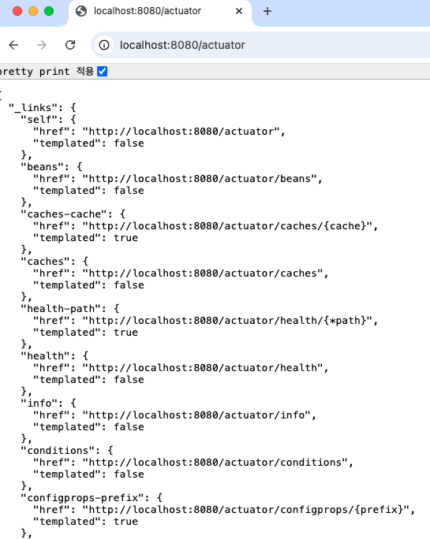

# Scenario
## Printing a log
### 1. Output to the logger
1. Add `Logger`
``` java
@Tag(name = "User API", description = "User API")
@RestController
@RequestMapping("/api/v1/users")
@RequiredArgsConstructor
public class UserController {

    // new add
    private static final Logger logger = LoggerFactory.getLogger(UserController.class);
```

3. print log

`logger.info("getAllUsers");`

```java
@GetMapping
public ResponseEntity<List<UserDTO>> getAllUsers() {
    logger.info("getAllUsers");

    List<UserDTO> users = userService.findAllUsers();

    return ResponseEntity.ok(users);
}
```

### 2. print log by lombok log
1. `@Slf4j` 추가
``` java
@Slf4j
@Service
@RequiredArgsConstructor
@Transactional
public class UserServiceImpl implements UserService {
}
```

2. print log

`log.info("Finding all users");`

```java
@Override
public List<UserDTO> findAllUsers() {
  log.info("Finding all users");

  return userRepository.findAll()
      .stream()
      .map(UserDTO::new)
      .collect(Collectors.toList());
}
```

3. Print logs by level
Print the log if it is a real error with the error level
- 
- GlobalApiExceptionHandler.java

`log.error("errorCode : {}, errorMessage : {}", ex.getErrorCode(), ex.getMessage());`

```java
@Slf4j
@RestControllerAdvice
public class GlobalApiExceptionHandler {

    @ExceptionHandler(BusinessLogicException.class)
    public ResponseEntity<ErrorResponse> BusinessLogicException(final BusinessLogicException ex) {
        log.error("errorCode : {}, errorMessage : {}", ex.getErrorCode(), ex.getMessage());

        final ErrorCode errorCode = ex.getErrorCode();
        return ResponseEntity.status(errorCode.getHttpStatus()).body(new ErrorResponse(errorCode));
    }
}
```

- Result
```
2024-09-26 15:06:21 [http-nio-8080-exec-1] ERROR l.g.c.e.GlobalApiExceptionHandler - errorCode : NOT_FOUND_USER, errorMessage : null
```

4. output the log to a file

[logback-spring.xml](src/main/resources/logback-spring.xml)
Add


## Add Spring Actuator
### Add build.gradle

```groovy
dependencies {
    implementation 'org.springframework.boot:spring-boot-starter-actuator'
}
```

### yml 설정 추가
```yaml
management:
  endpoints:
    web:
      exposure:
        include: "*"  # Expose all endpoints (default exposes only 'health' and 'info')
  endpoint:
    health:
      show-details: always  # Shows detailed information in the /health endpoint
```

Run the Application

- Access url

http://localhost:8080/actuator

- Result

