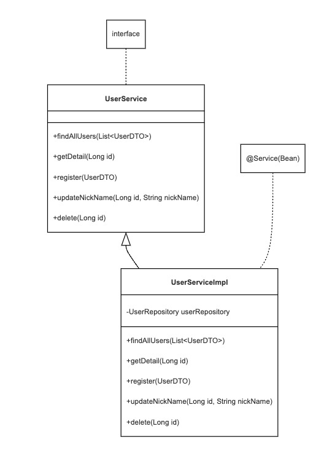

# Scenarios

## 1. Create a Service

### UserService Interface and Implementor (UserServiceImpl)


#### UserService.java, UserServiceImpl.java, UserDTO.java  생성

1. UserService.java
```java
public interface UserService {
}
```

2. UserServiceImpl.java 
```java
@Service 
@RequiredArgsConstructor
public class UserServiceImpl implements UserService {
    final UserRepository userRepository;
}

```

3. UserDTO.java
```java
public class UserDTO {
}
```

## 2. Modify and implement entity, service, and controller logic for the interfaces you create
### 1. Modify User Entity 
1. Change the @Id field type and generation strategy  
1-1. Existing String -> Long

1-2. @GeneratedValue(strategy = GenerationType.IDENTITY) 
: Generate Id values with auto-generation from the database

```
@EqualsAndHashCode(of = "id")
public class User {
    @Id
    @GeneratedValue(strategy = GenerationType.IDENTITY)
    @Column(name = "id")
    private Long id;
```

1-3. Modify import.sql

[import.sql](src/main/resources/import.sql)


### 2. Repository modifications
JpaRepository<User, **String**> -> JpaRepository<User, **Long**>

AS-IS
```java
public interface UserRepository extends JpaRepository<User, String> {
}
```

TO-BE
```java
public interface UserRepository extends JpaRepository<User, Long> {
}
```

### 3. Modify the Controller @PathVariable type

String identifier -> Change to Long id value

```
@GetMapping(value = "/{id}")
public ResponseEntity<UserDTO> getDetail(@PathVariable final Long id) {
}

@PutMapping(value = "/{id}")
public ResponseEntity<UserDTO> updateUser(@PathVariable final Long id,
                                          @RequestBody final String nickName) {
}

@DeleteMapping(value = "/{id}")
public ResponseEntity<Boolean> deleteUser(@PathVariable final Long id) {

}
```

### 4. Implementing the UserService
[UserService.java](src/main/java/la/gov/user/service/UserService.java)

[UserServiceImpl.java](src/main/java/la/gov/user/service/impl/UserServiceImpl.java)

### 5. Changing Controller injection objects
User Repository -> Change User Services
```
public class UserController {
    private final UserRepository userRepository;

    @Autowired
    public UserController(UserRepository repository) {
       userRepository = repository;
    }
}
```

```
@RequiredArgsConstructor
public class UserController {
    private final UserService userService;

}
```

## 3. Changes with the addition of Service Layer and DTOs
### 1. spring.jpa.open-in-view : false
Return from service to DTO to avoid persistence context to view(Controller) area.
For DB connection, false is recommended in practice.

### 2. Remove swagger (document) annotation mapped to User Entity

There are security benefits to not exposing DB table information to swagers.


AS-IS 
```java
@Schema(description = "User")
@Entity
@Table(name = "users_user")
@NoArgsConstructor(access = AccessLevel.PROTECTED)
@Getter
@EqualsAndHashCode(of = "identifier")
public class User {
    @Schema(name = "identifier", description = "identifier", example = "1")
    @Id
    @Column(name = "identifier")
    private String identifier;
}
```

TO-BE
```
@Entity
@Table(name = "users_user")
@NoArgsConstructor(access = AccessLevel.PROTECTED)
@Getter
@EqualsAndHashCode(of = "id")
public class User {
    @Id
    @GeneratedValue(strategy = GenerationType.IDENTITY)
    @Column(name = "id")
}
```

### 3. Expose only the information in the UserDTO that needs to be passed to the client.
User personal information can be hidden. (name, age, etc.,..)

```java
public class UserDTO {
    @Schema(name = "id", description = "id", example = "1")
    private Long id;

    @Schema(name = "nickName", description = "nickName", example = "Tony Stark")
    private String nickName;

    public UserDTO(final User user) {
        this.id = user.getId();
        this.nickName = user.getNickName();
        
        // hero의 누구인지 실제 이름과 나이는 공개하지 않는다.
    }
}
```

### 4. Enable method-specific transaction processing at the service layer.
You can use @Transactional for class level or method level.

```
@Service
@RequiredArgsConstructor
@Transactional
public class UserServiceImpl implements UserService {

}
```
