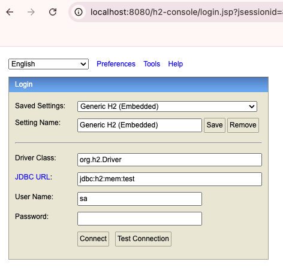
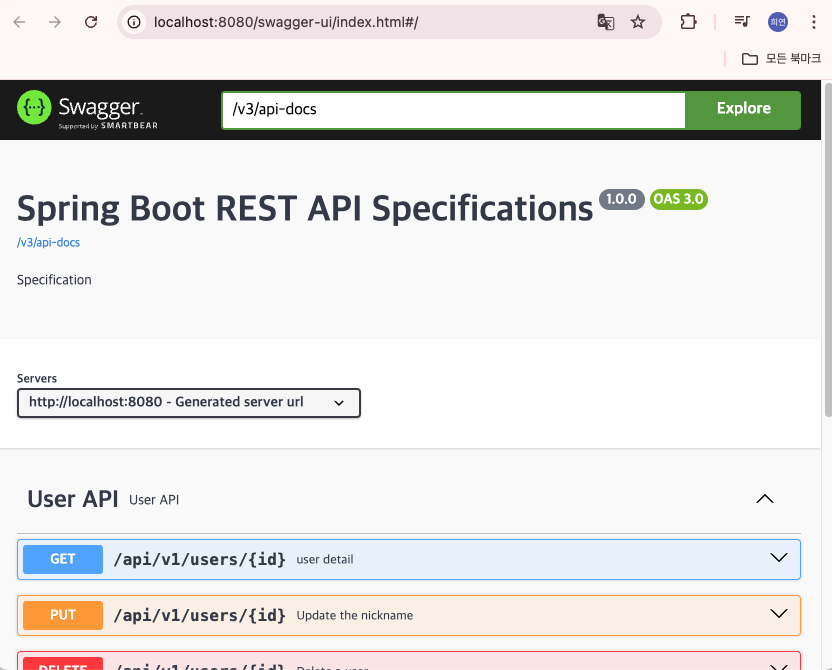
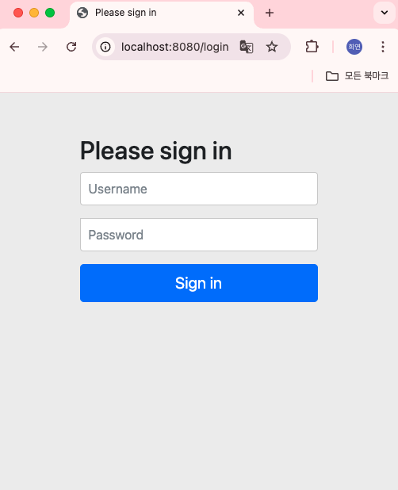
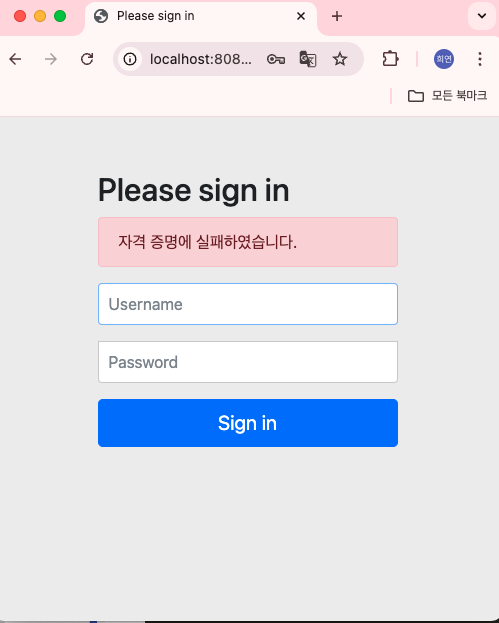
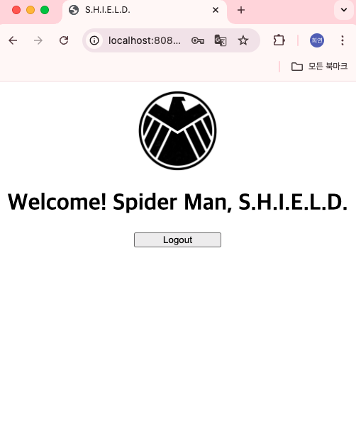
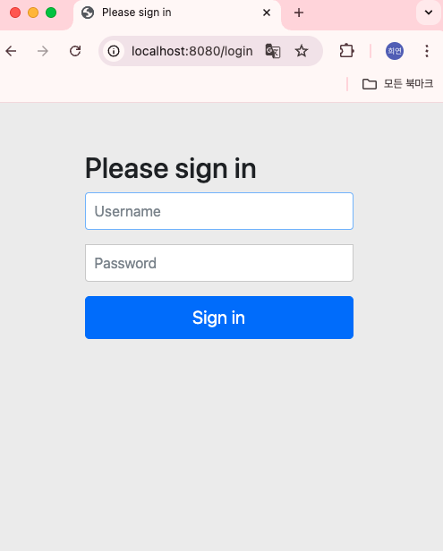

# Scenarios
Let's apply spring security


## Modify build.gradle
add `spring-security`

```groovy
dependencies {
    implementation 'org.springframework.boot:spring-boot-starter-security'
}
```

- apply test

1. Check logs when running an application
```
Using generated security password: c40c8568-e806-470b-8b91-7feec0cd196e

This generated password is for development use only. Your security configuration must be updated before running your application in production.
```

2. 401 or 403 errors on traditional API calls
- Request

```
GET http://localhost:8080/api/v1/users
Content-Type: application/json
```

- Response

```
HTTP/1.1 401 
Vary: Origin
Vary: Access-Control-Request-Method
Vary: Access-Control-Request-Headers
WWW-Authenticate: Basic realm="Realm"
X-Content-Type-Options: nosniff
X-XSS-Protection: 0
Cache-Control: no-cache, no-store, max-age=0, must-revalidate
Pragma: no-cache
Expires: 0
X-Frame-Options: DENY
Content-Length: 0
Date: Thu, 26 Sep 2024 07:23:37 GMT

<Response body is empty>
```

## SecurityConfig config

[SecurityConfig.java](src/main/java/la/gov/security/SecurityConfig.java)

```java
@Configuration
public class SecurityConfig {

    @Bean
    public SecurityFilterChain securityFilterChain(HttpSecurity http) throws Exception {
        // h2-console / swagger 접속 설정
        http
            .csrf(AbstractHttpConfigurer::disable)
            .httpBasic(withDefaults())
            .formLogin(withDefaults())
            .authorizeHttpRequests(authorizeRequest ->
                authorizeRequest
                    .requestMatchers(AntPathRequestMatcher.antMatcher("/h2-console/**")).permitAll()
                    .requestMatchers(AntPathRequestMatcher.antMatcher("/swagger-ui/**")).permitAll()
                    .requestMatchers(AntPathRequestMatcher.antMatcher("/v3/api-docs/**")).permitAll()
                    .anyRequest().authenticated()
            )
            .headers(headers ->
                headers.frameOptions(HeadersConfigurer.FrameOptionsConfig::disable)
            )
        ;
        
        return http.build();
    }
}
```
### Result

- h2-console



- swagger-ui



- Request API 

```
GET http://localhost:8080/api/v1/users
```

```
HTTP/1.1 403
X-Content-Type-Options: nosniff
X-XSS-Protection: 0
Cache-Control: no-cache, no-store, max-age=0, must-revalidate
Pragma: no-cache
Expires: 0
X-Frame-Options: DENY
Content-Length: 0
Date: Thu, 26 Sep 2024 08:10:16 GMT

<Response body is empty>

Response code: 403; Time: 58ms (58 ms); Content length: 0 bytes (0 B)
```

## Implementing Login

### Order
1. add id(username), password to User domain
2. set up login/logout page with Security
3. create login service, authentication object
4. create main go screen
5. check execution
 


### 1. User Entity에 [Account.java](src/main/java/la/gov/user/entity/Account.java) (username, password) 추가

```java
public class User {
    @Id
    @GeneratedValue(strategy = GenerationType.IDENTITY)
    @Column(name = "id")
    private Long id;
    
    @Column(name = "name")
    private String name;

    @Column(name = "age")
    private Integer age;
    
    @Column(name = "nickName")
    private String nickName;
    
    // 신규 추가 
    @Embedded
    private Account account;
  
    // User 객체 생성 방식 변경
    private User(final String name,
                 final Integer age,
                 final String nickName) {
      this.name = name;
      this.age = age;
      this.nickName = nickName;
    }

    private User(final String name,
                 final Integer age,
                 final String nickName,
                 final Account account) {
      this(name, age, nickName);
    
      this.account = account;
    }

    public static User createUser(final String name,
                                  final Integer age,
                                  final String nickName) {
        return new User(name, age, nickName);
    }
    
    public static User createUserWithAccount(final String name,
                                             final Integer age,
                                             final String nickName,
                                             final String username,
                                             final String password) {
    
        return new User(name, age, nickName, Account.create(username, password));
    }
}
```

Modify [import.sql](src/main/resources/import.sql) 

- Accounts

username : jarvis_master, password : shield_tony

username : mjolnir_master, password : shield_thor

username : vibranium_master, password : shield_steve

username : gammaray_master, password : shield_bruce

username : ant_master, password : shield_hank

username : spider_master, pasword : shield_peter

### 2. Add Security settings
```java
@EnableWebSecurity
@Configuration
public class SecurityConfig {
    @Bean
    public SecurityFilterChain securityFilterChain(HttpSecurity http) throws Exception {
      http
          .csrf(AbstractHttpConfigurer::disable)
          .httpBasic(withDefaults())
          .formLogin(e -> e.successForwardUrl("/main"))
          .authorizeHttpRequests(authorizeRequest ->
              authorizeRequest
                  .requestMatchers(AntPathRequestMatcher.antMatcher("/h2-console/**")).permitAll()
                  .requestMatchers(AntPathRequestMatcher.antMatcher("/swagger-ui/**")).permitAll()
                  .requestMatchers(AntPathRequestMatcher.antMatcher("/v3/api-docs/**")).permitAll()
                  .anyRequest().authenticated()
          )
          .logout((logout) -> logout
              .logoutSuccessUrl("/logout")
              .deleteCookies("JSESSIONID", "remember-me")
              .logoutSuccessUrl("/login")
          )
          .headers(headers ->
              headers.frameOptions(HeadersConfigurer.FrameOptionsConfig::disable)
          )
      ;
    
      return http.build();
    }

    @Bean
    public PasswordEncoder passwordEncoder() {
      return new BCryptPasswordEncoder();
    }
}
```

### 3. Create Login Service, Authentication Object

Create a UserLoginService that implements UserDetailsService
```java
@Service
@RequiredArgsConstructor
public class UserLoginService implements UserDetailsService {
    final UserRepository userRepository;

    @Override
    public UserDetails loadUserByUsername(final String username) throws UsernameNotFoundException {
        final User user = userRepository.findByAccount_username(username)
            .orElseThrow(UserNotFoundException::new);

        return new LoginUser(user);
    }
}
```

Create a LoginUser that implements UserDetails
```java
@Getter
public class LoginUser implements UserDetails {
    final User user;
   
    public LoginUser(final User user) {
      this.user = user;
    }
}
```

Add Security
```java
@EnableWebSecurity
@Configuration
@RequiredArgsConstructor
public class SecurityConfig {
    final UserLoginService userLoginService;
  
    @Bean
    public SecurityFilterChain securityFilterChain(HttpSecurity http) throws Exception {
      http
          .csrf(AbstractHttpConfigurer::disable)
          .httpBasic(withDefaults())
          .formLogin(e -> e.successForwardUrl("/main"))
              // Connect to the Login Authentication Object Service
              .userDetailsService(userLoginService)
          .authorizeHttpRequests(authorizeRequest ->
              authorizeRequest
                  .requestMatchers(AntPathRequestMatcher.antMatcher("/h2-console/**")).permitAll()
                  .requestMatchers(AntPathRequestMatcher.antMatcher("/swagger-ui/**")).permitAll()
                  .requestMatchers(AntPathRequestMatcher.antMatcher("/v3/api-docs/**")).permitAll()
                  .anyRequest().authenticated()
          )
          .logout((logout) -> logout
              .logoutSuccessUrl("/logout")
              .deleteCookies("JSESSIONID", "remember-me")
              .logoutSuccessUrl("/login")
          )
          .headers(headers ->
              headers.frameOptions(HeadersConfigurer.FrameOptionsConfig::disable)
          )
      ;
    
      return http.build();
    }
}
```

### 4. Create the main navigation screen

1. add thymeleaf to the view service

Modify build.gradle

```groovy
dependencies {
    implementation 'org.springframework.boot:spring-boot-starter-thymeleaf'
}
```

2. Write [MainController.java](src/main/java/la/gov/main/MainController.java)

```java
@Controller
@RequestMapping("/main")
public class MainController {
    
    @PostMapping
    public ModelAndView index(@AuthenticationPrincipal LoginUser loginUser,
                              ModelAndView mv) {
        // loginUser login credentials
        mv.addObject("data", String.format("Welcome! %s, S.H.I.E.L.D.", loginUser.getNickName()));
      mv.setViewName("index");
      return mv;
    }
}
```

3. Write [index.html](src/main/resources/templates/index.html)


### 5. Run Test 

access : localhost:8080/login 



- Login Fail 



- Login Success



- Logout

