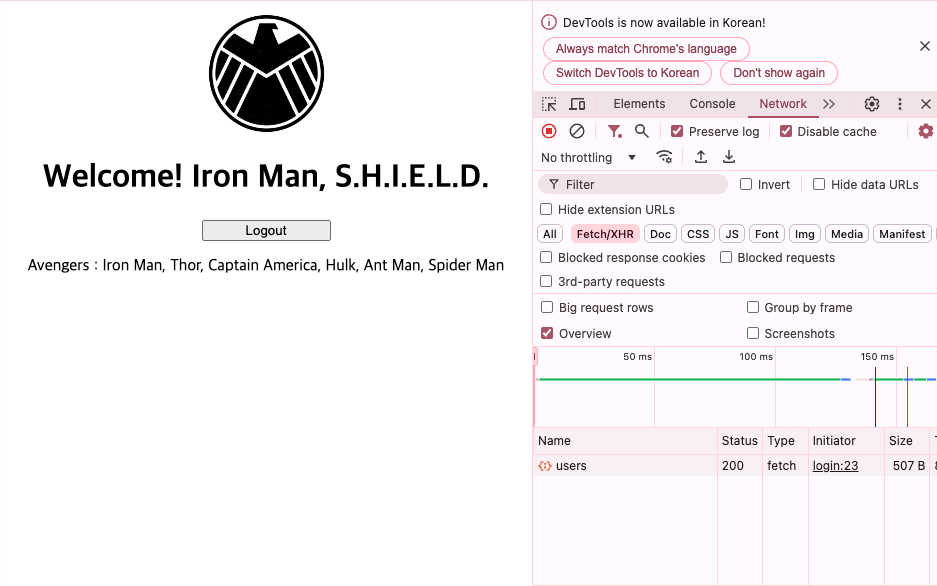
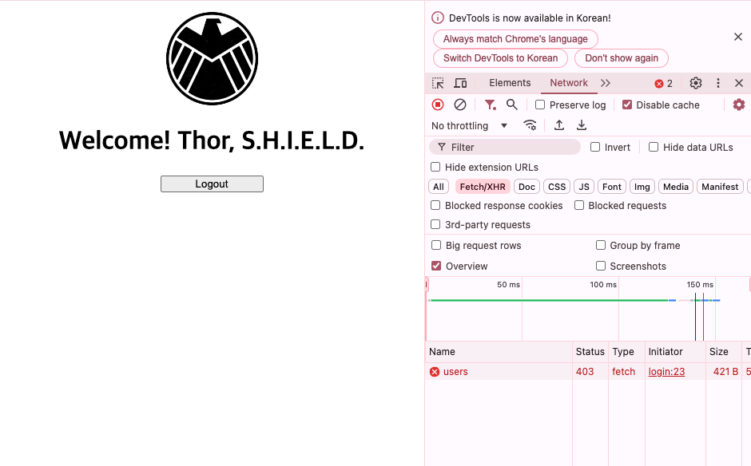

# Scenario

Let's isolate the data (API calls) that can be viewed by authorizing each user with the permissions provided by Spring Security
(authorization processing)

## Procedure
1. add permission(Role) to User domain
2. import authorization when creating Login service, Authentication object
3. change screen according to authorization
4. change API call
5. check execution


### 1. Add permissions (Role) to the User domain
1. Create a Permission Enum

[Role.java](src/main/java/la/gov/user/entity/Role.java)

2. Change User Domain
```java
public class User {
    @Enumerated(EnumType.STRING)
    private Role role;

    private User(final String name,
                 final Integer age,
                 final String nickName) {
      this.name = name;
      this.age = age;
      this.nickName = nickName;
      this.role = Role.USER;
    }
}
```

3. Modify [import.sql](src/main/resources/import.sql) 

Tony Stark(Iron Man) : ADMIN

etc : USER

### 2. Login service, importing authorization when creating authentication objects
Modify LoginUser

``` java 
@Getter
public class LoginUser implements UserDetails {
    @Override
    public Collection<? extends GrantedAuthority> getAuthorities() {
        // 사용자 권한 조회하여 SimpleGrantedAuthority 권한 부여
        return List.of(new SimpleGrantedAuthority(user.getRole().getName()));
    }

}
```

### 3. Screen changes based on permissions

- If Tony Stark (Iron Man) (ADMIN) is logged in, Avengers list is visible
- Avengers list not visible if etc(USER) is logged in

Modify index.html


``` html
<body onload="search()">
    <script>
        function search() {
            fetch('/api/v1/users')
                .then(response => response.json())  // Parsing server responses into JSON format
                .then(data => {
                    const heroes = data.map(hero => hero.nickName).join(', ');
                    document.getElementById("avengers").innerText = "Avengers : " + heroes;
                })
                .catch(error => {
                    console.error('Error:', error);  // print error 
                });
        }
    </script>
</img>
<h1 th:text="${data}" align="center"></h1>
<button type="button" onclick="click_logout()" class="center">Logout</button>
<p id="avengers" align="center"></p>
 
``` 


### 4. Change API calls
1. change SpringSecurity

Add `@EnableMethodSecurity(securedEnabled = true)`  
``` java 
@EnableWebSecurity
@EnableMethodSecurity(securedEnabled = true)
@Configuration
@RequiredArgsConstructor
public class SecurityConfig {
}
```

2. add UserController permission validation

Add `@Secured(“ROLE_ADMIN”)`

```java
public class UserController {
    private static final Logger logger = LoggerFactory.getLogger(UserController.class);
   
    @Operation(
        summary = "user list",
        description = "Query saved users in the form of a list."
    )
    @ApiResponse(responseCode = "200",
        description = "Success"
    )
    @Secured("ROLE_ADMIN")
    @GetMapping
    public ResponseEntity<List<UserDTO>> getAllUsers(@AuthenticationPrincipal LoginUser loginUser) {
      logger.info("getAllUsers");
   
      List<UserDTO> users = userService.findAllUsers();
   
      return ResponseEntity.ok(users);
    }
}
```

### 5. Confirm execution
- Click Account

username : jarvis_master, password : shield_tony

username : mjolnir_master, password : shield_thor

- Tony Stark (Iron Man) (ADMIN) logged in

 


- Screen with Thor Odinson (Thor) (USER) logged in




